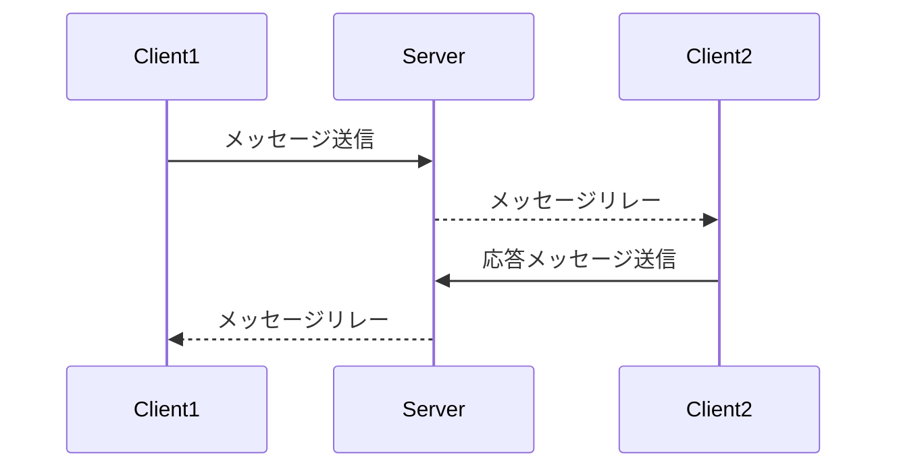

# プロジェクト名

オンラインチャットメッセンジャー (Online Chat Messenger)

## 概要

オンラインチャットメッセンジャーは、Pythonを使用して構築されたシンプルなチャットアプリケーションです。このプロジェクトは、サーバーと複数のクライアント間でリアルタイムのメッセージ通信を可能にします。

## 特徴

- 複数のクライアント間でのリアルタイムチャット
- TCPとUDPソケットを使用した通信の実装
- カスタムチャットルームの作成と参加
- ユーザー認証とセキュリティ機能

## このプロジェクトを通して学べること・習得できること

- **ネットワークプログラミング**：Pythonの`socket`ライブラリを使用したTCPおよびUDP通信の実装方法
- **マルチスレッド処理**：`threading`モジュールを用いた同時並行処理の実践
- **設計パターンの理解**：クライアントサーバーモデルやリレーシステムの構築方法
- **エラーハンドリング**：例外処理やエラー発生時の対処法の習得
- **プロトコル設計**：カスタム通信プロトコルの設計と実装

以下は、システムの全体的な概念図です。



## 必要条件

- Python 3.x
- **標準ライブラリ**：
  - `socket`
  - `threading`
  - `asyncio`（必要に応じて）

## インストール手順

1. リポジトリをクローンします。

   ```bash
   git clone https://github.com/yourusername/online-chat-messenger.git
   ```

2. プロジェクトディレクトリに移動します。

   ```bash
   cd online-chat-messenger/stage2
   ```

## 使用方法

### サーバーの起動

サーバーを起動するには、以下のコマンドを実行します。

```bash
python server.py
```

### クライアントの起動

別のターミナルウィンドウで、クライアントを起動します。

```bash
python client.py
```

複数のクライアントを起動することで、他のユーザーとチャットを行うことができます。

## 機能一覧

- **チャットルームの作成**：新しいチャットルームを作成できます。
- **チャットルームへの参加**：既存のチャットルームに参加できます。
- **メッセージの送信**：リアルタイムでメッセージを送受信できます。
- **ユーザー認証**：トークンを使用したユーザー認証機能があります。

## 技術スタック

- **プログラミング言語**：Python 3
- **ネットワーク通信**：`socket`ライブラリによるTCP/UDP通信
- **並行処理**：`threading`モジュールによるマルチスレッド実装
- **非同期処理**（オプション）：`asyncio`ライブラリ

## 追加資料

- **UMLシーケンス図**：詳細な関数呼び出しの流れを示すシーケンス図は`docs/sequence_diagram.md`を参照してください。
- **設計ドキュメント**：システムの設計に関する詳細は`docs/design_overview.md`に記載されています。

## 貢献方法

1. このリポジトリをフォークします。
2. フォークしたリポジトリをクローンします。

   ```bash
   git clone https://github.com/yourusername/online-chat-messenger.git
   ```

3. 新しいブランチを作成します。

   ```bash
   git checkout -b feature/your-feature-name
   ```

4. コードを編集し、機能を追加またはバグを修正します。
5. 変更をコミットします。

   ```bash
   git commit -m "Add your commit message"
   ```

6. リモートリポジトリにプッシュします。

   ```bash
   git push origin feature/your-feature-name
   ```

7. プルリクエストを作成します。

## ライセンス

このプロジェクトはMITライセンスの下で公開されています。